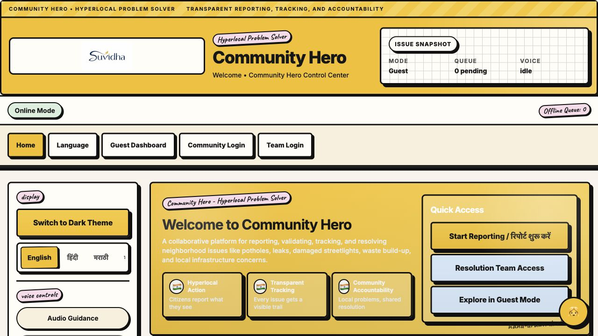
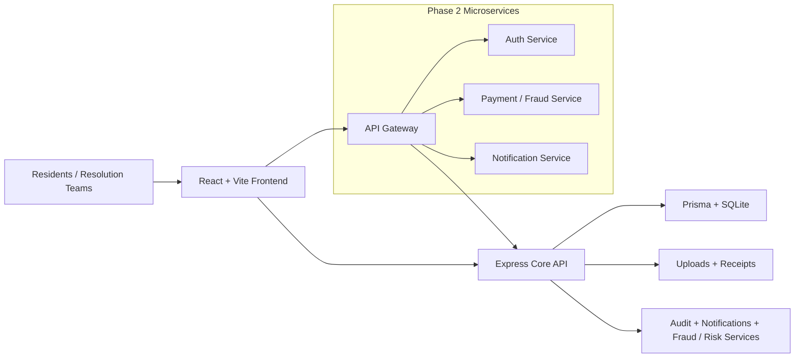

# Community Hero Prompt war

<p align="center">
  
</p>

<p align="center">
  
</p>

<p align="center">
  <a href="https://react.dev/"></a>
  <a href="https://expressjs.com/"></a>
  <a href="https://www.prisma.io/"></a>
  
</p>

Community Hero is a hyperlocal issue reporting and resolution platform built around the idea that neighborhood problems should be easy to report, visible to track, and accountable to resolve.

It reframes a civic-service workflow into a community-first product where residents can:

- report local issues quickly
- escalate repeated problems
- upload evidence
- track progress with reference IDs
- follow visible resolution status
- support action workflows through payments and records

## Problem Statement Alignment

### Background

Communities frequently face issues such as potholes, water leakages, damaged streetlights, waste management concerns, and public infrastructure challenges. Reporting these issues is often fragmented, difficult to track, and lacks transparency.

### Challenge

Build a platform that enables citizens to identify, report, validate, track, and resolve community issues through collaboration, data, and intelligent automation. The solution should encourage transparency, accountability, and community participation.

### Evaluation focus

The solution should demonstrate how AI can help communities address local challenges more efficiently through improved reporting, verification, tracking, and resolution of issues.

## How This Project Answers The Challenge

Community Hero already implements the core foundation of the challenge in a working product:

- structured issue reporting
- escalation logging for unresolved problems
- evidence upload
- reference-based issue tracking
- admin-side resolution dashboards
- voice-guided and multilingual access
- offline-safe queuing for key flows

It also includes platform hooks that make it suitable for the next layer of intelligent automation:

- issue-type classification through existing category-driven flows
- evidence-aware validation workflows
- dashboard-ready operational data
- fraud/risk analysis patterns already used in the payment pipeline
- audit logging and device heartbeat signals that support trustworthy operations

## Current Product Preview

This screenshot is from the current locally running version of the app after aligning the UI and copy to the hyperlocal problem-solving theme.



## What Residents Can Do

### Report local issues

Residents can submit neighborhood issue reports using structured categories such as:

- pothole / road damage
- water leakage / drainage
- broken streetlights
- waste management concerns

### Escalate repeated problems

When an issue remains unresolved or needs stronger follow-up, residents can raise an escalation record with added context.

### Upload evidence

Evidence uploads support local accountability by attaching:

- issue photos
- location proof
- supporting records or media

### Track issue resolution

Every issue or escalation returns a reference ID that can be used to monitor status transparently.

### Access inclusive support

The product includes:

- multilingual UI
- voice guidance
- voice-assisted field filling
- on-screen keyboard and keypad
- high contrast support
- manual light/dark theme
- idle privacy reset for shared-device environments

## What Resolution Teams Can Do

Authorized staff can use the admin area to:

- view incoming issue reports
- review escalations
- inspect attached evidence context
- update lifecycle statuses
- track operational activity
- monitor dashboards and health
- close resolved or rejected records

## Feature Mapping Against The Problem Statement

### Implemented now

- Structured issue reporting
- Hyperlocal issue categories
- Escalation workflow
- Real-time status lookup by reference ID
- Evidence upload workflow
- Impact and operations dashboards
- Voice and accessibility support
- Offline queueing for unstable connectivity

### Partially represented / ready for extension

- AI-powered issue categorization
  Current state: category-driven reporting is in place and can be upgraded with model-based classification.

- Community verification
  Current state: escalation and evidence workflows are present and can evolve into resident verification loops.

- Predictive insights
  Current state: dashboards, audit data, and issue metadata are available for future trend and hotspot analysis.

- Gamification for citizen engagement
  Current state: not implemented yet, but the user and activity structure is available for a future participation layer.

- Geo-location and mapping
  Current state: not implemented yet in the current frontend, but the reporting flow is ready for map and location capture expansion.

## UX Direction

The frontend has been redesigned into a premium retro neo-brutalist dashboard experience so that the product feels memorable, visible, and accessible in shared community settings.

Design characteristics include:

- thick borders
- hard shadows
- paper-like surfaces
- pastel contrast system
- handwritten accent labels
- bold hierarchy
- responsive control sidebar
- polished light and dark themes

Key files:

- `client/src/index.css`
- `client/src/components/Layout.jsx`
- `client/src/components/LanguageToggle.jsx`
- `client/src/components/KioskButton.jsx`
- `client/src/pages/*`

## User Flows

### Resident flow

1. Open the welcome screen.
2. Select a language.
3. Log in with OTP or continue in guest mode.
4. Choose one of the main actions:
   - report issue
   - escalate issue
   - upload evidence
   - support payment
   - track issue
5. Save the generated reference ID.

### Resolution team flow

1. Open team login.
2. Sign in using mobile and password.
3. Verify the OTP challenge.
4. Review issue reports and escalations.
5. Update statuses and monitor dashboards.

## Screens In The Current App

### Resident-facing

- `/` : welcome screen and community overview
- `/language` : language selection
- `/login` : community login and OTP flow
- `/dashboard` : action hub
- `/services` : report a new issue
- `/complaints` : escalate a local problem
- `/upload-documents` : upload issue evidence
- `/payment` : support payment flow
- `/status-tracking` : issue tracking
- `/receipt` : receipts and records

### Team-facing

- `/admin` : resolution team login
- `/admin/dashboard` : resolution hub analytics
- `/admin/requests` : issue report management
- `/admin/complaints` : escalation management
- `/admin/users` : user listing
- `/admin/reports` : impact dashboards

## Architecture Overview



## Tech Stack

### Frontend

- React 18
- Vite 5
- Tailwind CSS 3
- Redux Toolkit
- React Router DOM
- i18next / react-i18next
- Axios

### Backend

- Node.js
- Express
- Prisma
- SQLite
- JWT authentication
- bcrypt
- Helmet
- express-rate-limit
- multer
- PDFKit
- Nodemailer
- Twilio

### Deployment and packaging

- Docker
- Docker Compose
- Kubernetes manifests
- phase-2 microservice layout

## Repository Structure

```text
.
├── client/
│   ├── public/branding/
│   └── src/
│       ├── components/
│       ├── data/
│       ├── i18n/
│       ├── pages/
│       ├── redux/
│       └── services/
├── server/
│   ├── controllers/
│   ├── middleware/
│   ├── routes/
│   ├── services/
│   ├── utils/
│   └── API.md
├── microservices/
│   ├── api-gateway/
│   ├── auth-service/
│   ├── notification-service/
│   └── payment-fraud-service/
├── assets/
├── k8s/
├── DEPLOYMENT.md
├── MICROSERVICES_PHASE2.md
├── SUVIDHA_ARCHITECTURE.md
└── docker-compose.yml
```

## Local Development

### Prerequisites

- Node.js 18+
- npm 9+
- Git

### Backend setup

```bash
cd server
npm install
cp .env.example .env
npx prisma generate
npx prisma db push
npm run seed:admin
```

### Frontend setup

```bash
cd client
npm install
cp .env.example .env
```

### Run locally in two terminals

Terminal 1:

```bash
cd server
PORT=5003 CORS_ORIGIN='http://localhost:5173,http://localhost:8080' npm run dev
```

Terminal 2:

```bash
cd client
npm run dev -- --host 0.0.0.0 --port 5173
```

### Local URLs

- Frontend: `http://localhost:5173`
- Backend health: `http://localhost:5003/api/health`

## Docker Compose

The repository ships with a Compose stack that includes:

- `suvidha-core-service`
- `suvidha-auth-service`
- `suvidha-payment-fraud-service`
- `suvidha-notification-service`
- `suvidha-api-gateway`
- `suvidha-client`

Run it with:

```bash
docker compose up --build
```

## Default Local Team Credentials

After seeding:

- Mobile: `9999999999`
- Password: `Admin@123`

The team login still uses MFA:

1. mobile + password
2. OTP verification

## API Snapshot

Detailed endpoint notes live in [server/API.md](server/API.md).

Important routes:

- `POST /api/auth/send-otp`
- `POST /api/auth/verify-otp`
- `POST /api/services/request`
- `POST /api/complaints`
- `POST /api/documents/upload`
- `POST /api/payments/create`
- `POST /api/payments/verify`
- `GET /api/services/application-status/:id`
- `GET /api/admin/dashboard`
- `GET /api/admin/requests`
- `GET /api/admin/complaints`
- `PUT /api/admin/update-status/:id`
- `DELETE /api/admin/close/:id`

## Security And Trust Signals

- JWT-protected routes
- role-based access control
- OTP-driven auth flows
- rate limiting
- password hashing
- audit logging
- device heartbeat support
- consent-driven uploads

## AI And Intelligence Roadmap

To align even more directly with the problem statement, the strongest next upgrades would be:

1. AI-powered issue categorization from text and uploaded evidence
2. geo-tagging and map clustering of issue hotspots
3. community validation loops for duplicate or repeated reports
4. predictive dashboards for likely failure zones and recurring issue types
5. gamified participation rewards for residents who submit strong evidence and valid reports

## Troubleshooting

### Port already in use

```bash
lsof -nP -iTCP:5003 -sTCP:LISTEN
lsof -nP -iTCP:5173 -sTCP:LISTEN
```

### Prisma mismatch

```bash
cd server
npx prisma generate
npx prisma db push
```

### Admin account missing after reset

```bash
cd server
npm run seed:admin
```

### Frontend dependency issue with Rollup optional native package

```bash
rm -rf client/node_modules client/package-lock.json
cd client
npm install
```

## Additional Docs

- [DEPLOYMENT.md](DEPLOYMENT.md)
- [MICROSERVICES_PHASE2.md](MICROSERVICES_PHASE2.md)
- [SUVIDHA_ARCHITECTURE.md](SUVIDHA_ARCHITECTURE.md)
- [server/API.md](server/API.md)

